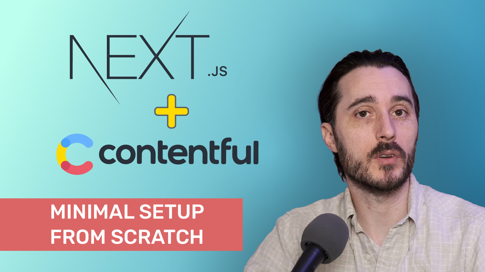

# Next.js + Contentful Project

This repo accompanies the youtube series starting at [this video](https://youtu.be/MbEIGh5cWWI):

<a href="https://youtu.be/MbEIGh5cWWI" alt="video thumbnail: Next.js + Contentful minimal setup from scratch">

</a>

## Getting Started

You'll need to have a Contentful space already created, and a `.env.local` file with the following:

```
CONTENTFUL_SPACE_ID=<your-contentful-space-id>
CONTENTFUL_ACCESS_TOKEN=<your-contentful-access-token>
```

This project assumes you followed the same Contentful model setup, otherwise the `src/product1.js` file will need to be modified to match your Contentful data.

To run the server:

```bash
npm run dev
```

Open [http://localhost:3000](http://localhost:3000) with your browser to see the result.
